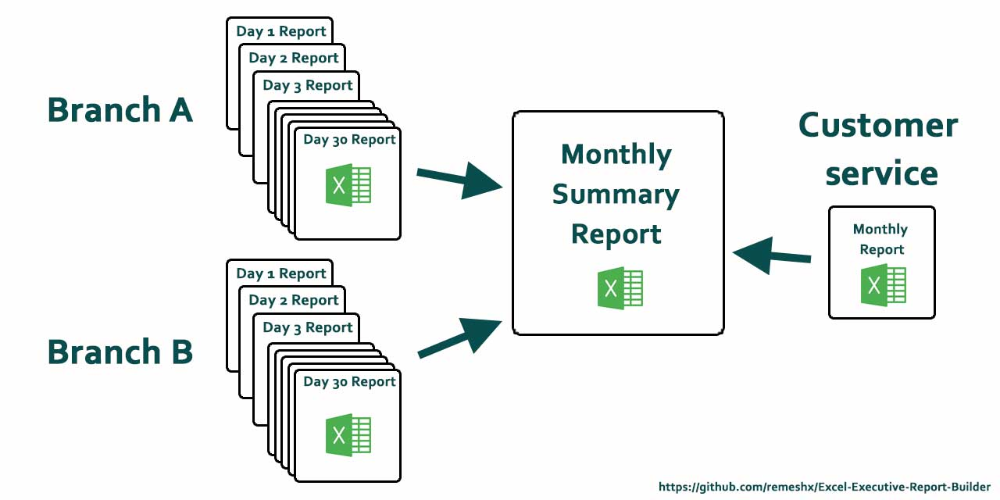

# Executive Summary Report Builder In Excel



Executive Summary Report Builder In Excel is an application that summarize different type of reports into one report file. This can helps using Excel to combine reports and manage them easily.I have generated specific invented coding language for this application which is written in Excel cells (Like [[DA1:$A]]). This simplified language would let the operator creates millions of executive reports regardless of input report formats.
Just mention that this application was generated in 2010 for a oil company to summarize its daily reports which came from several drilling rigs.


## Installation

There is no installation needed. However you must create your own report formats. I will explain how to create report format in this Readme file.

## Usage

You need to define your report format for the application to be able to generate summarize reports. for each report you need at least 2 format. one is called the reference report which is generated by departments or branches and used as an input for summarize report. The second format is the summarized report format. However, you should know how the application works. I will give you a simple example that shows the process :

Imagine that we have two table as follows :


And we want to generate a new report from these two table. We would address every important cells in which data are stored. These tables are our <b>Reference</b> tables and We name them as A` and B`:


Now we can address each cell individually. for instance $D1 in table A which holds number 1 in it. in this application when we want to refer to a specific table we use letter D following the Table name. As a result, the Table A would appear as DA in application. Following this DA:$D would refer to the $D cell of Table A which Holds the number 1 in it.

Now we are going to create a summarize report as Table called C which its first cell is equal to the first cell in table A and its second cell is equal to second cell in table B. We just need to create this format as mentioned above and the result should be something like following table :


So here is a complete example :


As an Other example, if we need our summarize report to show sum of numbers in cell $D in both table A and B, we should write following format in our summarize report:


```
DA:$D + DB:$D
```
NOTE: every formula as above is defined in a double bracket to have meaning for the application.


## Advance Features

Now if your have daily report from different departments and branches which have same format, you can refer to each report by indicating the report number.


In this case DA3:$D means the $D cell of 3th report of table A. So the same A` format that has addressed table A is work the same for all these reports. These type of reports called DTMR which stands for Daily To Monthly Reports. you need to identify each of your Table References format. Please refer to Table formats in this read me file.


There are some predefined function as well for counting a specific cell contents :

```
CIE:1|DA:$K
```

For eample, the above function will count cells which has addressed as $K in table A that stored a number 1 :


Finally, you can use the Excel functions with the application formulas as follow :

```
[[DA:$T]] + S3
```

## Sample Reports

I have provided a sample report that includes most of the features of the application. I assumed a two branch grocery shop manager who is provided by different daily branch reports everyday. Additionally, customer service department would create a single weekly report from its activities at the end of the week. The manager uses all daily report of all branches plus the weekly report of customer service to generate a single page Executive Summary Report that indicates the total weekly performance of the shops. In this case we have 7 daily reports from branch A and 7 daily reports from branch B. We also have a weekly report from customer service. All these reports are accessible in <b>Sample</b> folder.

I have created a Weekly report format in <b>Forms\Weekly Report Sample\Weekly Branch Report.xls</b>. This report format has three references (Branch A report, Branch B report, Customer service as C). These references are defined in a second sheet of the "Weekly Branch Report.xls". These references files are also stored in a <b>Refs</b> folder in the same path. Each of these references are addressed properly. The format for branches daily reports is DTMR which means we have several report with same format.

After starting application and giving the sample reports, the application generates a summarize report. This output is accessible in Sample/Result Folder.


